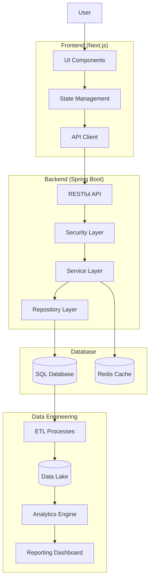

# System Architecture Overview

This diagram illustrates the high-level architecture of our application, encompassing the frontend, backend, database, and data engineering components.

# Backend (Spring Boot)
i) Complete API for user management, wallet operations, and transactions  
ii) Secure authentication with JWT  
iii) Transaction processing logic for deposits, withdrawals, and transfers  
iv) Database models and repositories

# Frontend (Next.js)
i) User authentication screens (login/register)   
ii) Dashboard with wallet overview and transaction history  
iii) Deposit, withdrawal, and transfer functionality  
iv) Interactive charts for transaction visualization

# Data Engineering Pipeline
i) Comprehensive data flow from operational database to data warehouse  
ii) Change Data Capture (CDC) for real-time data streaming  
iii) Apache Kafka for event messaging  
iv) Data Lake architecture with landing, processed, and curated zones  
v) ETL processes using Apache
